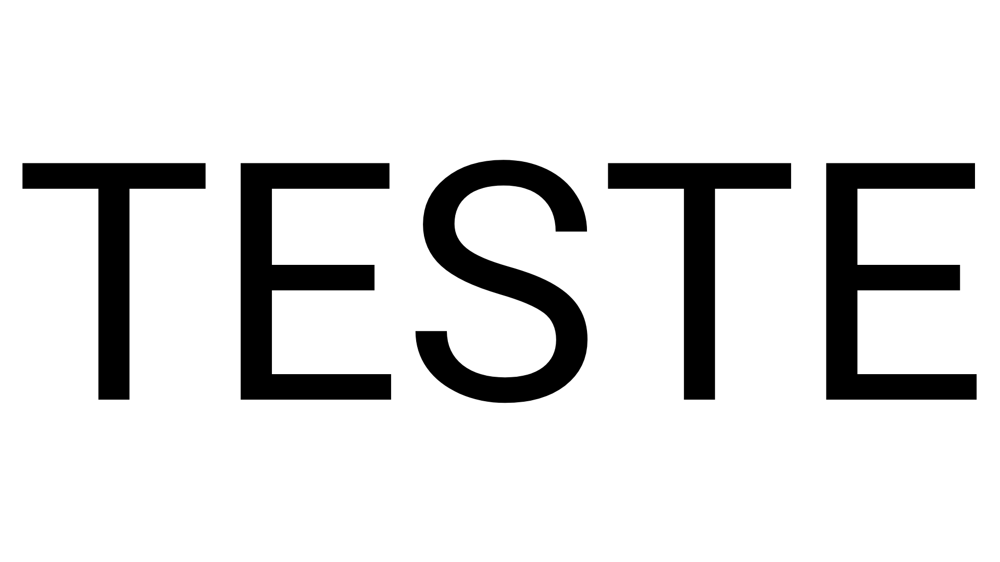
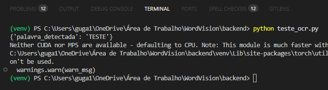

# WordVision - OCR with Python, EasyOCR and OpenCV


### 📄 Description

**WordVision** is an Optical Character Recognition (OCR) project that detects words in images using Python, EasyOCR, and OpenCV. This project aims to convert text from images into editable and readable digital text with high accuracy by combining image preprocessing and OCR techniques.

---
### 🚀 Features

- 🔍 Word detection from images
- 🧠 Preprocessing techniques for better OCR accuracy (OpenCV)
- ✨ Post-processing with automatic correction for common OCR mistakes
- 🐍 Fully developed in Python
- 🔧 Easy to run and test locally

---
### 📸 Demo
#### 🔍 Input Image

#### 💻 Terminal Output
The following output shows the result of running the test script (`teste_ocr.py`), which processes an image and returns the detected word.


```bash
(venv) PS C:\Users\guga1\OneDrive\Área de Trabalho\WordVision\backend> python teste_ocr.py
{'palavra_detectada': 'TESTE'}
Neither CUDA nor MPS are available - defaulting to CPU. Note: This module is much faster with a GPU.
C:\Users\guga1\OneDrive\Área de Trabalho\WordVision\backend\venv\Lib\site-packages\torch\utils\data\dataloader.py:665: UserWarning: 'pin_memory' argument is set as true but no accelerator is found, then device pinned memory won't be used.
  warnings.warn(warn_msg)
(venv) PS C:\Users\guga1\OneDrive\Área de Trabalho\WordVision\backend>
```
---
### 🛠️ Technologies

- Python
- EasyOCR
- OpenCV
- Pillow
- NumPy
- python-Levenshtein

---
### 📦 Installation

#### 1. Clone the repository
```bash
git clone https://github.com/kzugz/wordvision.git
cd wordvision
```
#### 2. Create a virtual environment
```bash
python -m venv venv
```
#### 3. Activate the virtual environment
- Windows (CMD):
```bash
venv\Scripts\activate
```
- Windows (PowerShell):
```bash
.\venv\Scripts\Activate.ps1
```
- Linux/macOS:
```bash
source venv/bin/activate
```
#### 4. Install dependencies
```bash
pip install -r requirements.txt
```
---
### ▶️ How to Use
Follow these steps to run the backend server and test the OCR functionality.
#### 1. Run the backend:
```bash
python app.py
```
#### 2. Test with the OCR script:
```bash
python teste_ocr.py
```
---
### 🛣️ Roadmap
#### Next Steps / Future Ideas
- 🖥️ Develop a graphical user interface (GUI) to simplify the OCR usage, removing the need to use the terminal.
- ✍️ Implement handwritten text recognition to expand the types of text supported by the system.
- ⚡ Optimize performance, including GPU support when available, to speed up processing.
- 🧪 Add automated tests to ensure code stability and quality.
- 🌐 Expand the GUI with additional features such as uploading multiple images and real-time result visualization.
- 🔧 Improve preprocessing and postprocessing techniques to increase OCR accuracy across different image types.
- 🛠️ Implement a continuous integration (CI) pipeline to automate testing and local deployments.
---
### 📂 Project Structure
```bash
wordvision/
├── .vscode/
│ ├── settings.json
├── backend/
│ ├── app.py
│ ├── ocr.py
│ ├── requirements.txt
│ ├── teste_ocr.py
│ ├── utils.py
├── frontend/
│ ├── assets/
│ ├── index.html
│ ├── script.js 
│ ├── style.css
├── .gitignore
├── LICENSE
├── README.md
```
---
### ⚖️ License
This project is licensed under the MIT License - see the [LICENSE](LICENSE) file for details.

---
### 🤝 Contribution

Contributions, issues and feature requests are welcome!  
Feel free to open an issue or submit a pull request.

Please make sure to follow the code of conduct.

---
### 🔗 Connect with me

- [GitHub](https://github.com/kzugz)  
- [LinkedIn](https://www.linkedin.com/in/kzugz)

---